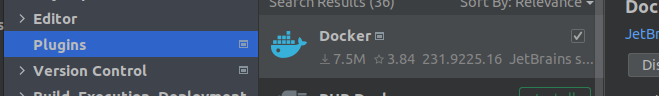
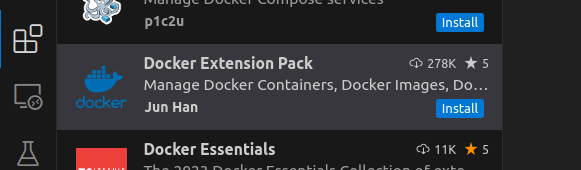

# Docker crash course (Docker and Compose)

---

## prerequisites

- JDK
- IDE
- [git project](/workspace/personal/k8s-demo/) 
- [docker](https://docs.docker.com/engine/install/)
  - check if docker is running: `docker run hello-world`
 
---

# Agenda

- Project
- Docker
  - Create image
  - Running container
  - Networking
- Docker compose
  - Create compose-file
  - Add database
  - Externalize configuration
  - Split over multiple composes
  

---

# Create your first Docker container

## Dockerfile

- create a file called `Dockerfile`

```docker
FROM debian

ENTRYPOINT ["echo", "Hello world"]
```

- build this file through the following command

```
docker build . -t my-hello-world
```

- run the image

```
docker run my-hello-world
```

---

# Docker CLI

- docker image ...
  - ls (Lists images)
  - rm (Removes image)
  - build (alias for docker build)

- docker container ...
  - ls (Lists containers. Add --all for stopped containers)
  - rm (Removes container)
  - run (alias for docker run)
  - stop (Stops running container)
  - ...

---

# Project

```java
@SpringBootApplication
@RestController
public class K8sDemoApplication {

    public static void main(String[] args) {
        SpringApplication.run(K8sDemoApplication.class, args);
    }

    @GetMapping("/")
    public String helloWorld() {
        return "Hello World";
    }

}
```

- Run the spring app
- `curl localhost:8080`

---

# Create a docker image

## dockerfile

- create a file called `Dockerfile` in the project root
- Soon it will look like this

```docker
FROM eclipse-temurin:21-jdk-alpine

ARG JAR_FILE
COPY ${JAR_FILE} app.jar

EXPOSE 8080

ENTRYPOINT ["java","-jar","/app.jar"]
```

---

# Create a docker image

## dockerfile

### FROM

```docker
FROM eclipse-temurin:21-jdk-alpine
```

- Base Image
  - Includes java 21 installation
- Build on top of it
- [Dockerhub](https://hub.docker.com/)

---

# Create a docker image

## dockerfile

### COPY

```docker
FROM eclipse-temurin:21-jdk-alpine

COPY build/libs/k8s-demo-0.0.1-SNAPSHOT.jar app.jar
```

- Copy
  - A local file to the image
  - rename file


---

# Create a docker image

## dockerfile

```docker
FROM eclipse-temurin:21-jdk-alpine

COPY build/libs/k8s-demo-0.0.1-SNAPSHOT.jar app.jar

ENTRYPOINT ["java","-jar","/app.jar"] 
# java -jar /app.jar
```

- Entry point

---

# Create a docker image

## Build the image

```sh
./gradlew build
docker build -t demo:latest .
```

---

# Run a docker image

`docker run demo:latest`
&
`curl localhost:8080`

---

# Run a docker image

`docker run demo:latest`

### Problem

```
➜  ~ curl localhost:8080
curl: (7) Failed to connect to localhost port 8080 after 0 ms: Connection refused
```

### Solution

- Expose
- Publish

---

# Networking

## Expose

```docker
FROM eclipse-temurin:21-jdk-alpine

COPY build/libs/k8s-demo-0.0.1-SNAPSHOT.jar app.jar

EXPOSE 8080

ENTRYPOINT ["java","-jar","/app.jar"]
```

- Optional
- Documentation
- Ports available in container

---

# Networking

## Publish

- Bind a container port to a host port
- `-p, --publish`
- `docker run -p 8080:8080 demo:latest`

---

# Create a docker image

## ARG

```docker
FROM eclipse-temurin:21-jdk-alpine

ARG JAR_FILE
COPY ${JAR_FILE} app.jar

EXPOSE 8080

ENTRYPOINT ["java","-jar","/app.jar"]
```

```sh
docker build --build-arg JAR_FILE=build/libs/k8s-demo-0.0.1-SNAPSHOT.jar -t demo:latest .
```

- Argument 
  - Passed when we build the docker image

---

# Docker Compose

- Define multi container applications
- Centralize configuration in 1 yaml file
- Is **not K8s**, it **lacks** **production**-features like
  - load balancing
  - service discovery
  - Auto scaling
- But it's
  - relatively **easy** to set up
  - **automates** a lot for **devs**
    - middleware, databases without installation
    - closest simple thing to production... 

Let's get started...

---

## Part 1: create a simple application

### Step 1: Create a Spring Boot application

* Use the following link to create a simple Spring Boot-app through **Spring Initializr**

https://start.spring.io/#!type=gradle-project&language=java&platformVersion=3.4.0&packaging=jar&jvmVersion=21&groupId=com.example&artifactId=demo&name=demo&description=Demo%20project%20for%20Spring%20Boot&packageName=be.demo.docker.hello&dependencies=web

* Click "Generate" and download
* Import the application into your favorite IDE or editor

---

### Step 2: Add a dockerfile

Add the following **Dockerfile** to the root of your project

~~~docker
FROM eclipse-temurin:21-jdk-alpine
RUN addgroup -S spring && adduser -S spring -G spring
USER spring:spring
ARG JAR_FILE=./build/libs/*-SNAPSHOT.jar
COPY ${JAR_FILE} app.jar
ENTRYPOINT ["java","-jar","/app.jar"]
~~~

---

### Step 3: Add a docker-compose-file

Add a docker-compose.yml

```yaml
services:
  learning-service:
    container_name: demo_application
    build:
      dockerfile: Dockerfile
    image: demo_application:latest
    ports:
      - "8080:8080"
```

---

### Step 4: Add a simple controller

~~~java
package be.demo.docker.hello;

import org.springframework.web.bind.annotation.GetMapping;
import org.springframework.web.bind.annotation.RestController;

@RestController
public class DemoController {

    @GetMapping("/")
    public String helloWorld() {
        return "Hello World";
    }
}
~~~

---

### Step 5: Perform a build

~~~bash
$ ./gradlew clean build
OpenJDK 64-Bit Server VM warning: Sharing is only supported for boot loader classes because bootstrap classpath has been appended

BUILD SUCCESSFUL in 4s
8 actionable tasks: 8 executed
$ 
~~~

---

### Step 5: Build the image

~~~bash
$ docker compose build
[+] Building 0.7s (9/9) FINISHED                                                                                                                                        docker:default
 => [learning-service internal] load build definition from Dockerfile
 => => transferring dockerfile: 250B
 => [learning-service internal] load metadata for docker.io/library/eclipse-temurin:21-jdk-alpine                                                                                 0.5s
 => [learning-service internal] load .dockerignore
 => => transferring context: 2B
 => [learning-service 1/3] FROM docker.io/library/eclipse-temurin:21-jdk-alpine@sha256:49...
 => [learning-service internal] load build context
 => => transferring context: 113B
 => CACHED [learning-service 2/3] RUN addgroup -S spring && adduser -S spring -G spring
 => CACHED [learning-service 3/3] COPY ./build/libs/*-SNAPSHOT.jar app.jar
 => [learning-service] exporting to image
 => => exporting layers
 => => writing image sha256:c27890b580ba722b75812245285797ed42ab267c052362c6be46f9d62db57a22
 => => naming to docker.io/library/demo_application:latest
 => [learning-service] resolving provenance for metadata file
$ 
~~~

---

### Step 6: Build and run the container

~~~bash
$ docker compose up
[+] Running 1/0
 ✔ Container demo_application  Created                                                                                                                                            0.1s 
Attaching to demo_application
demo_application  | 
demo_application  |   .   ____          _            __ _ _
demo_application  |  /\\ / ___'_ __ _ _(_)_ __  __ _ \ \ \ \
demo_application  | ( ( )\___ | '_ | '_| | '_ \/ _` | \ \ \ \
demo_application  |  \\/  ___)| |_)| | | | | || (_| |  ) ) ) )
demo_application  |   '  |____| .__|_| |_|_| |_\__, | / / / /
demo_application  |  =========|_|==============|___/=/_/_/_/
...
demo_application  | 2024-11-25T22:34:19.265Z  INFO 1 --- [demo] [           main] be.demo.docker.hello.DemoApplication     : Started DemoApplication in 1.784 seconds (process running for 2.237)
~~~

----

### Important tip: build and run

* You can also combine build and run in one command

~~~bash
$ docker compose up --build
~~~

----

### Important tip: IDE-support for docker-compose

(running the docker-compose directly)





---

## Part 2: create a "composed" application

* Java-application
* Database (mysql)

Let's get started

---

### Step 1: Create a (new) Spring Boot application

* Use the following link to create a simple Spring Boot-app through **Spring Initializr**

> jpa-starter + mysql-driver has been added

https://start.spring.io/#!type=gradle-project&language=java&platformVersion=3.4.0&packaging=jar&jvmVersion=21&groupId=be.demo.docker&artifactId=demodb&name=demodb&description=Demo%20project%20for%20Spring%20Boot&packageName=be.demo.docker.demodb&dependencies=web,data-jpa,mysql

* Click "Generate" and download
* Import the application into your favorite IDE or editor

---

### Step 2: Same Dockerfile as before

Add the following **Dockerfile** to the root of your project

~~~docker
FROM eclipse-temurin:21-jdk-alpine
RUN addgroup -S spring && adduser -S spring -G spring
USER spring:spring
ARG JAR_FILE=./build/libs/*-SNAPSHOT.jar
COPY ${JAR_FILE} app.jar
ENTRYPOINT ["java","-jar","/app.jar"]
~~~

---

### Step 3: Add the (extended) docker-compose-file

Add a docker-compose.yml

```yaml
services:
  learning-service:
    container_name: db_demo_application
    build:
      dockerfile: Dockerfile
    image: db_demo_application:latest
    environment:
      - TZ=Europe/Brussels
      - DB_HOST=mysql_learning
      - DB_NAME=learning_db
      - DB_USERNAME=learning
      - DB_PASSWORD=learning
      - DB_PORT=3306
    ports:
      - "8080:8080"
    expose:
      - "8080"
    volumes:
      - ./infra_/logs/:/logs/
  db:
    image: mysql:latest
    container_name: mysql_learning
    restart: always
    environment:
      MYSQL_DATABASE: 'learning_db'
      MYSQL_USER: 'learning'
      MYSQL_PASSWORD: 'learning'
      MYSQL_ROOT_PASSWORD: 'learning'
    ports:
      - "3306:3306"
    expose:
      - "3306"
    volumes:
      - ./infra_/mysql/storage/_data:/var/lib/mysql
```

---

### Step 4a: Make an entity and repo

~~~java
package be.demo.docker.hellodb;

import jakarta.persistence.Entity;
import jakarta.persistence.GeneratedValue;
import jakarta.persistence.GenerationType;
import jakarta.persistence.Id;

@Entity(name="hello")
public class HelloMessage {
    @Id
    @GeneratedValue(strategy= GenerationType.AUTO)
    private Long id;

    private String message;

    protected HelloMessage() {

    }

    public HelloMessage(String message) {
        this.message = message;
    }

    public String getMessage() {
        return message;
    }

    public void setMessage(String message) {
        this.message = message;
    }
}
~~~

----

### Step 4b: Add a repo

~~~java
package be.demo.docker.hellodb;

import org.springframework.data.jpa.repository.JpaRepository;

public interface HelloRepo extends JpaRepository<HelloMessage, Long> {
}
~~~

-----

### Step 4c: Add the controller

~~~java
package be.demo.docker.hellodb;

import jakarta.transaction.Transactional;
import org.springframework.beans.factory.annotation.Autowired;
import org.springframework.web.bind.annotation.GetMapping;
import org.springframework.web.bind.annotation.RequestParam;
import org.springframework.web.bind.annotation.RestController;

import java.util.stream.Collectors;

@RestController
public class HelloWorldController {

    @Autowired
    private HelloRepo helloRepo;

    @GetMapping("sayhello")
    @Transactional
    public String sayhello(@RequestParam String hello) {
        helloRepo.save(new HelloMessage(hello));
        return "You said " + hello;
    }

    @GetMapping("listhellos")
    @Transactional
    public String listhellos() {
        return helloRepo.findAll()
                .stream().map(HelloMessage::getMessage)
                .collect(Collectors.joining("\n"));
    }
}
~~~

---

### Step 4d: Override the application-properties

* Override the application.properties

~~~properties
spring.application.name=demodb

spring.jpa.hibernate.ddl-auto=update
spring.datasource.url=jdbc:mysql://${DB_HOST}:${DB_PORT}/${DB_NAME}?useSSL=false&allowPublicKeyRetrieval=true
spring.datasource.password=${DB_USERNAME}
spring.datasource.username=${DB_PASSWORD}
spring.jpa.properties.hibernate.dialect=org.hibernate.dialect.MySQL8Dialect

logging.file.path=/logs/measurements.log
~~~

---

### Step 5: Perform a gradle-build

* Before removing the build remove the test

~~~bash
$ ./gradlew  clean build -x test

BUILD SUCCESSFUL in 1s
6 actionable tasks: 6 executed
bart@linuxcomputers:~/Downloads/demodb$ 
$
~~~

> For now we skip tests because the database is not available

---

### Step 6: Run and build the compose

~~~bash
$ docker compose up --build
...
mysql_learning       | 2024-11-25T23:28:10.576494Z 0 [System] [MY-010116] [Server] /usr/sbin/mysqld (mysqld 8.2.0) starting as process 1
mysql_learning       | 2024-11-25T23:28:10.584372Z 1 [System] [MY-013576] [InnoDB] InnoDB initialization has started.
mysql_learning       | 2024-11-25T23:28:10.719351Z 1 [System] [MY-013577] [InnoDB] InnoDB initialization has ended.
db_demo_application  | 
db_demo_application  |   .   ____          _            __ _ _
db_demo_application  |  /\\ / ___'_ __ _ _(_)_ __  __ _ \ \ \ \
db_demo_application  | ( ( )\___ | '_ | '_| | '_ \/ _` | \ \ \ \
db_demo_application  |  \\/  ___)| |_)| | | | | || (_| |  ) ) ) )
db_demo_application  |   '  |____| .__|_| |_|_| |_\__, | / / / /
db_demo_application  |  =========|_|==============|___/=/_/_/_/
...
$ 
~~~

---

### Step 7: test

~~~
$ curl http://localhost:8080/sayhello?hello=first_message
You said first_message
$ curl http://localhost:8080/listhellos
first_message
$ curl http://localhost:8080/sayhello?hello=second_message
You said second_message
$ curl http://localhost:8080/listhellos
first_message
second_message
$
~~~

## Part 3: split the compose file to allow for native development

---

### Create a separate folder

* Copy the database-part in a docker-compose-db.yml

```yaml
services:
  db:
    image: mysql:latest
    container_name: mysql_learning
    restart: always
    environment:
      MYSQL_DATABASE: 'learning_db'
      MYSQL_USER: 'learning'
      MYSQL_PASSWORD: 'learning'
      MYSQL_ROOT_PASSWORD: 'learning'
    ports:
      - "3306:3306"
    expose:
      - "3306"
    volumes:
      - ./infra_/mysql/storage/_data:/var/lib/mysql
```

---

### Split compose

* Remove the db-part from the original yml
* Provide an include

```yaml
include:
  - docker-compose-db.yml
services:
  learning-service:
    container_name: db_demo_application
    build:
      dockerfile: Dockerfile
    image: db_demo_application:latest
    environment:
      - TZ=Europe/Brussels
      - DB_HOST=mysql_learning
      - DB_NAME=learning_db
      - DB_USERNAME=learning
      - DB_PASSWORD=learning
      - DB_PORT=3306
    ports:
      - "8080:8080"
    expose:
      - "8080"
    volumes:
      - ./infra_/logs/:/logs/
```
---

### Run the application

* Run the dedic

```bash
$ docker compose -f docker-compose-db.yml up --build
```

---

### Run the application

```bash
 java -DDB_PORT=3306 -DDB_USERNAME=learning -DDB_PASSWORD=learning -DDB_NAME=learning_db -DDB_HOST=localhost  -jar build/libs/*-SNAPSHOT.jar 
```